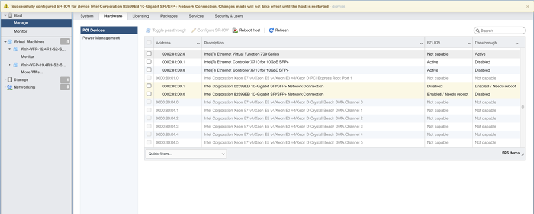
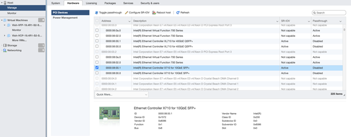
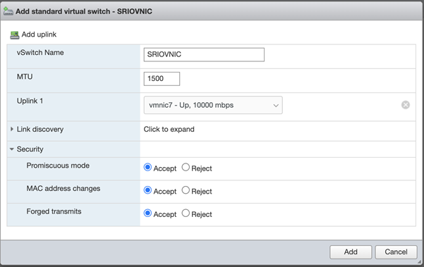
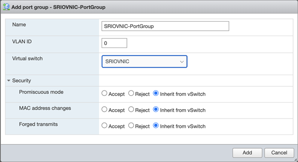
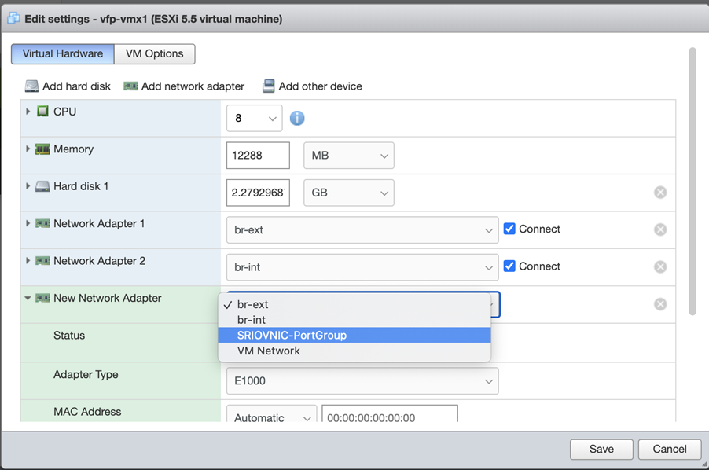
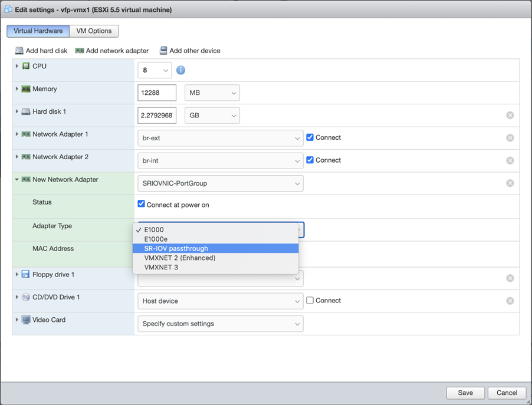
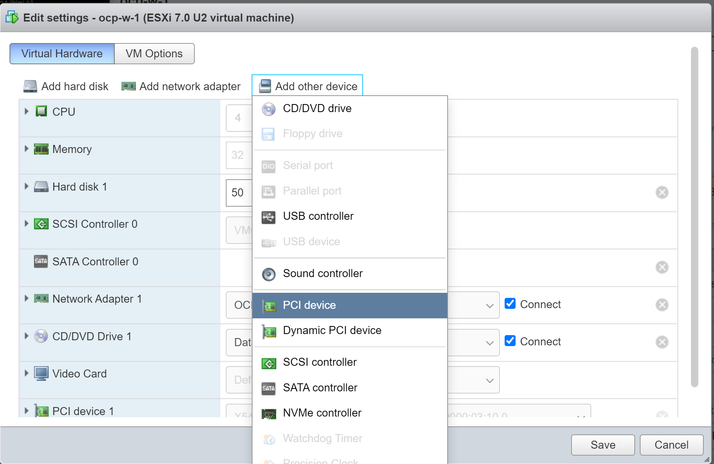
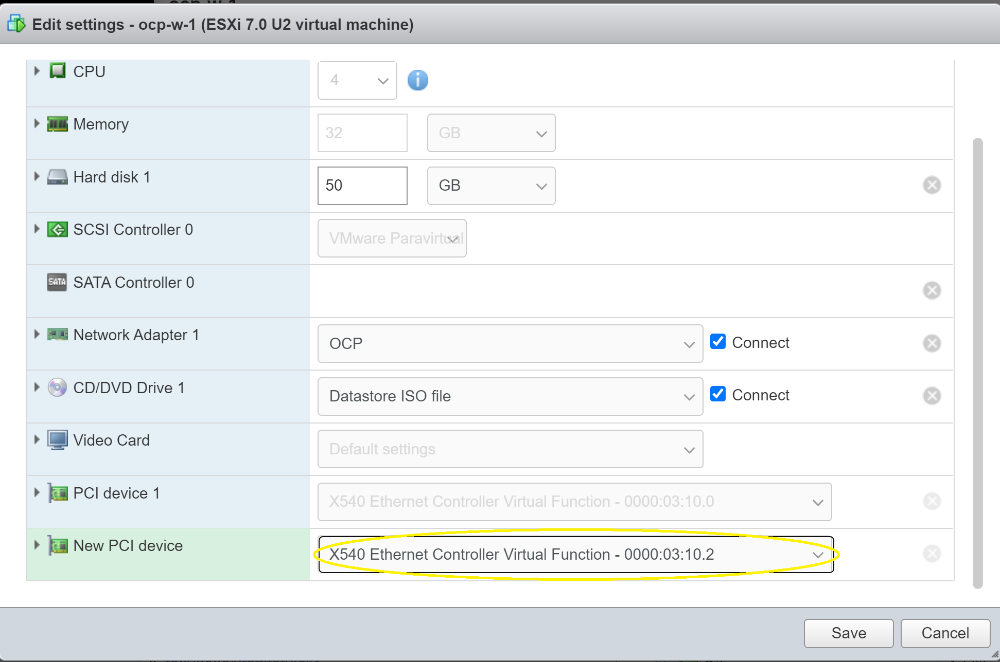
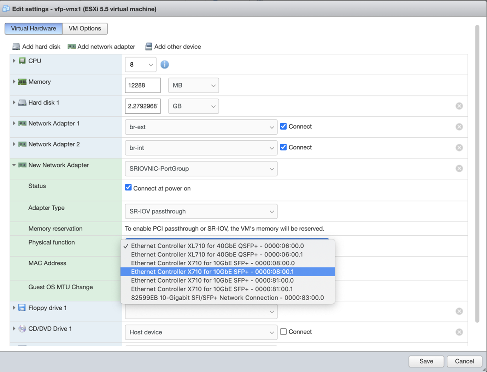

Enabling SR-IOV for VMware
The physical network interfaces support single root I/O virtualization (SR-IOV) capability and can be connected to the VMs using PCI passthrough. Before you enable SR-IOV for VMware, note the following:

SR-IOV is only supported with Intel and Mellanoxx Network Cards using ixgbe driver with 10G ports and using i40e driver. Any other NIC models are not supported.

Support for ixgbe driver and i40e driver is available from SPK 1.2.3 onwards.

Starting in SPK 1.2.4, in VMware deployments operating in SR-IOV mode with an ESXi Enterprise plus server, support is available for VLAN-tagged traffic for vMX interfaces.

To enable SPK with vSphere for SR-IOV adapters, perform these tasks:

## **Enable Virtualization Technology in the Server BIOS**
in order to enable SR-IOV capabilities, the BIOS need to support Virtualization Technology (VTx) feature. Reboot the Server and then press ESC or F10 in your keyboard. look for System Security adn then Virtualization Technology. Set it to enabled. The Screenshot below was taken from an Z820 HP Workstation that supports SR-IOV Virtual Function tecnology.


## **Enable SR-IOV on a Physical Adapter**

Use the following steps to enable SRX-IOV on a physical adapter. The following procedures are applicable for ESXi version 6.5.
To enable SR-IOV on a physical adapter in vSphere client:
1.Navigate to the host in the left navigation pane and click the Manage tab. Go to Hardware tab. Under PCI Devices option, select the physical adapter and click Configure SR-IOV option. 

1. In the populated window, select Yes to enable SR-IOV. In the virtual functions text box, specify the number of virtual functions to configure for the adapter.

1. Click Save.
1. Restart the host.
1. Verify the status of SR-IOV post reboot. The status is displayed as Active. 

## **Add vSwitch and Port Groups**

Use the following steps to enable SRX-IOV on a physical adapter if you are using ESXi version 7.0:
To add vSwitch and Port Groups:

1.To create vSwitch: Navigate to Networking tab and select Virtual Switches and click Add standard virtual switch. 


2.To create port groups: Navigate to Networking tab and select Port Groups and click Add port group.


## **Assigning the SR-IOV NIC to the SPK VM Worker Node**

Use the following steps to enable SRX-IOV on a physical adapter if you are using ESXi version 7.0:
To assign the SR-IOV to the SPK VM Worker Node for the**Ingress PCI VF flow** using the vSphere Web Client do the following:

1. Power-off the VFP when you add SR-IOV to the VFP VM.
1. Navigate to the VFP VM in the left navigation pane and click the **Manage** tab.
1. Select **VM Hardware**, and click **Edit** near the top right corner.
1. In the Edit setting, go to **Virtual Hardware** tab and click **Add network adapter** option.
1. Under New Network Adapter, select the respective port group for mapping. 

1. Change **Adapter Type** as SR-IOV passthrough.

1. Map Physical function to respective SR-IOV NIC. 

1. Click Save.
Now, the SR-IOV interface is added to the SPK VM Worker Node.
1. Repeat Step 9 for the **Egress PCI VF Flow.**

Alternatively the 2 PCI Virtual Functions (VFs) can be manually added to the VM worker Node directly in the PCI VF configuration where 1 VF will be configured for the Ingress Flow and another for Egress Flow both to be be assigned to the SPK Worker Node as follows:

1. Navigate under **Virtual Machines**, select the **VM Guest Worker Node** that wil be assigned the PCI Card, click **Edit** and then finally under**Virtual Hardware** hit **add other device** as in the example below:

1. Select the desired Virtual Fuction (VF) 

2. Repeat the process for other VM GUEST Worker Nodes

## **Enable VLAN Tagging on SR-IOV Interfaces**

You can configure VLAN tagging on SR-IOV interfaces on SPK instance deployed in VMware ESXi host with the following steps:
We've used the hardware and software combination for the following procedure:

VMware ESXi version 7.0 Update 3
Intel Corp X540T2 Converged Network Adapters T2
Firmware version X540 Ethernet Controller Virtual Function for Intel X540T2 Converged Network Adapters T2 Series

1. Enter the CLI configuration mode after logging in to the vMX.
1. Include the vlan-tagging statement to enable VLAN tagging.
   ```bash
   [edit interfaces xe-0/0/0]
   user@host# set vlan-tagging
   ```
1. Include the vlan-offload statement to offload the VLAN filtering.
   ```bash
   [edit interfaces xe-0/0/0]
   user@host# set vlan-offload
   ```
1. Verify with:
```bash
user@host> show configuration interfaces xe-0/0/0 
vlan-tagging;
vlan-offload;
encapsulation flexible-ethernet-services;
unit 0 {
    encapsulation vlan-vpls;
    vlan-id 10;
    family vpls;
}
unit 1 {
    vlan-id 30;
    family inet {
        address 30.30.30.1/30;
    }
}
unit 2 {
    encapsulation vlan-bridge;
    vlan-id 40;
}
```
1. Log in to the ESXi Web console . Navigate to **Networking** and select **Port groups** tab. Edit the settings for the required port.


Enable the VLAN trunking for the vSwitch that includes the SR-IOV interface. You must set the VLAN value to 4095.
Note the following:

The VLAN ID 4095 allows any VLAN traffic.

The VLAN ID 0 does not allow any VLAN traffic.

Ensure that you have configured the VLAN ID matching to the VLAN configuration on the mapped interface. Example: If you have configured a VLAN ID 100 on the associated logical interface, then use VLAN ID 100 for SR-IOV. This setting enables receive and forwarding incoming frames that contain a matching VLAN ID that is VLAN 100.

1. Click Save to save your settings.

## **SR-IOV Interface for Layer 2 Services**

To use SR-IOV interface for Layer 2 Services such as VPLS, Layer 2 VPN, Layer 2 circuit or bridging on a vMX instance deployed in VMware ESXi host, you must enable the trust mode and disable the spoof check in Intel NIC settings. Use the following steps to enable the trust mode and disable the spoof check:
1. Install Intel esxcli plug-in. For instructions, see VMware KB article KB37149.
1. Verify the trust mode and the spoof check status on the SR-IOV NIC by entering the following command in ESXi shell mode:
   ```bash
   esxcli intnet sriovnic vf get -v <vf number> -n <vmnic name>
   ```
Example:

```bash
root@host:~] esxcli intnet sriovnic vf get -v 0 -n vmnic12
VF ID           Trusted         Spoof Check
-----           -------         -----------
0               false            true
```
1. Enable the trust mode and disable the spoof check on Intel NIC.
```bash
esxcli intnet sriovnic vf set -s false -t true -v <vf number> -n <vmnic name>
```
    Example:

```bash
[root@host:~] esxcli intnet sriovnic vf set -s false -t true -v 0 -n vmnic12
Trusted mode is set to true and spoof check is set to false
```
```bash
[root@host:~] esxcli intnet sriovnic vf get -v 0 -n vmnic12
VF ID           Trusted         Spoof Check
-----           -------         -----------
0               true            false
```
1. Restart the vMX FPC configured with the SR-IOV interface after changing to the trust mode and spoof check values.
```bash
user@host> request chassis fpc slot <number> restart
```
Once the FPC is online, Layer-2 services start working on SR-IOV interface.
